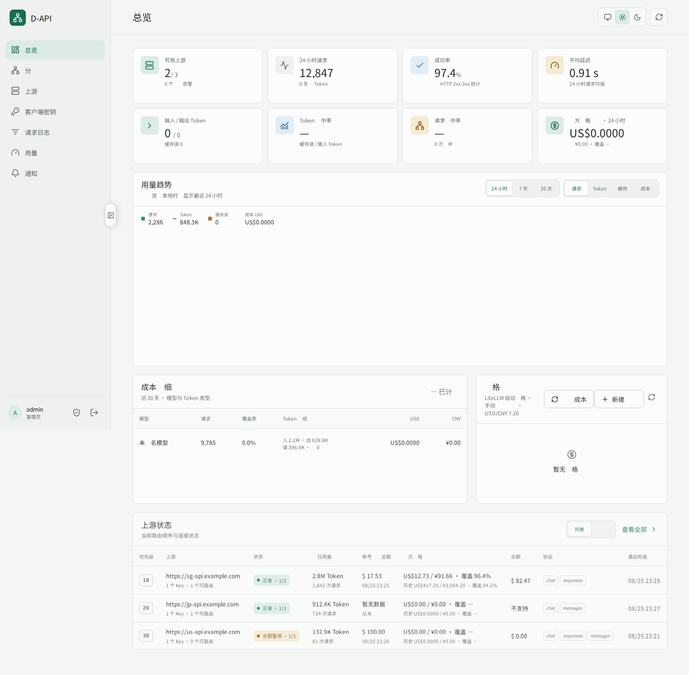
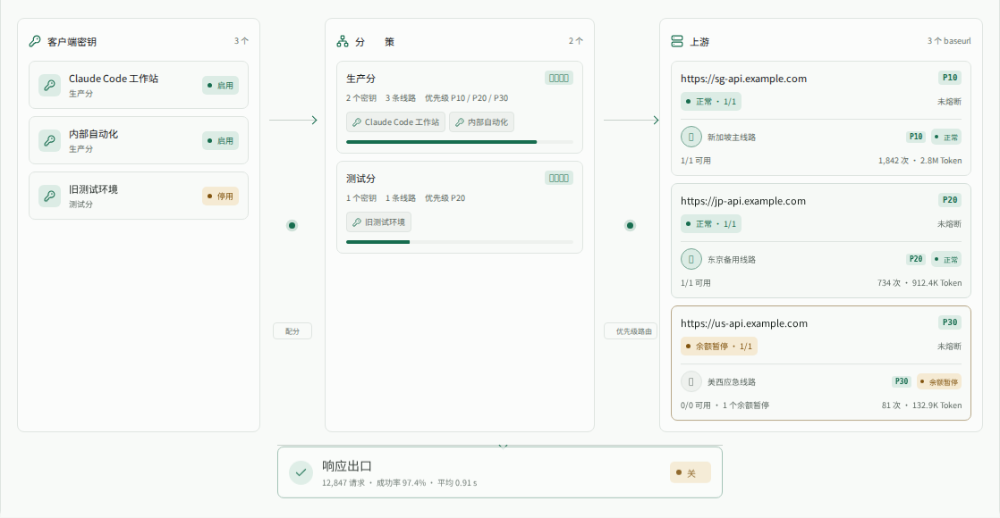

# D-API 界面截图

以下图片来自自动化视觉回归环境，域名、线路、账号、请求量、余额和成本均为示例数据，
不对应真实生产部署。

## 运维总览

总览同时展示上游健康、请求量、成功率、延迟、Token、缓存命中率、成本估算、价格档案
和按 Base URL 聚合的上游状态。

## 请求路由拓扑

拓扑视图展示客户端 Key、所属分组、优先级队列、相同 Base URL 集群与响应出口。
该视图用于观察和解释路由关系，实际请求仍按数据库中的分组成员和 Key 级优先级执行。
